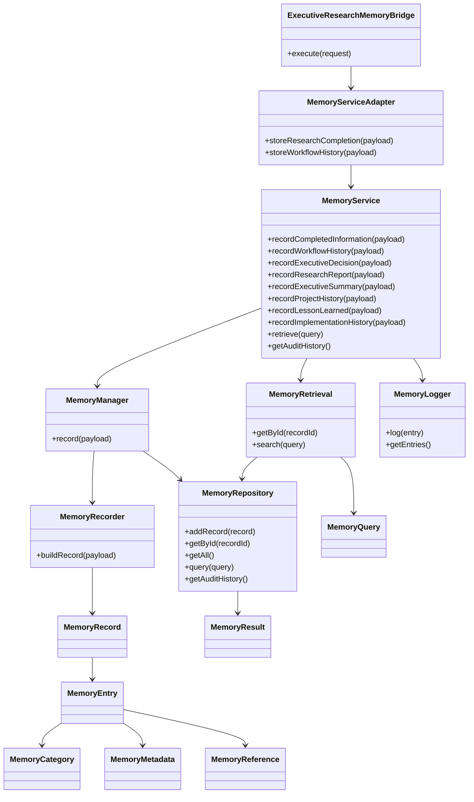

# Class Diagram - Memory Service v1.0

```mermaid
classDiagram
  class MemoryService {
    +recordCompletedInformation(payload)
    +recordWorkflowHistory(payload)
    +recordExecutiveDecision(payload)
    +recordResearchReport(payload)
    +recordExecutiveSummary(payload)
    +recordProjectHistory(payload)
    +recordLessonLearned(payload)
    +recordImplementationHistory(payload)
    +retrieve(query)
    +getAuditHistory()
  }

  class MemoryManager {
    +record(payload)
  }

  class MemoryRecorder {
    +buildRecord(payload)
  }

  class MemoryRepository {
    +addRecord(record)
    +getById(recordId)
    +getAll()
    +query(query)
    +getAuditHistory()
  }

  class MemoryRetrieval {
    +getById(recordId)
    +search(query)
  }

  class MemoryLogger {
    +log(entry)
    +getEntries()
  }

  class MemoryRecord
  class MemoryEntry
  class MemoryCategory
  class MemoryMetadata
  class MemoryReference
  class MemoryQuery
  class MemoryResult

  class ExecutiveResearchMemoryBridge {
    +execute(request)
  }

  class MemoryServiceAdapter {
    +storeResearchCompletion(payload)
    +storeWorkflowHistory(payload)
  }

  MemoryService --> MemoryManager
  MemoryService --> MemoryRetrieval
  MemoryService --> MemoryLogger
  MemoryManager --> MemoryRecorder
  MemoryManager --> MemoryRepository
  MemoryRetrieval --> MemoryRepository
  MemoryRecorder --> MemoryRecord
  MemoryRecord --> MemoryEntry
  MemoryEntry --> MemoryCategory
  MemoryEntry --> MemoryMetadata
  MemoryEntry --> MemoryReference
  MemoryRepository --> MemoryResult
  MemoryRetrieval --> MemoryQuery
  ExecutiveResearchMemoryBridge --> MemoryServiceAdapter
  MemoryServiceAdapter --> MemoryService
```
