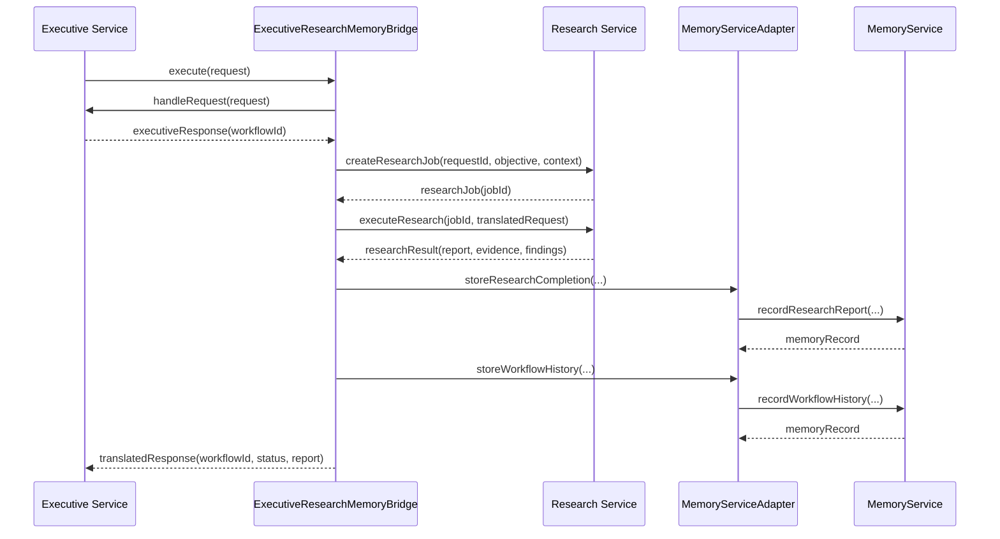

# Sequence Diagram - Executive -> Research -> Memory

```mermaid
sequenceDiagram
  participant Executive as Executive Service
  participant Bridge as ExecutiveResearchMemoryBridge
  participant Research as Research Service
  participant Adapter as MemoryServiceAdapter
  participant Memory as MemoryService

  Executive->>Bridge: execute(request)
  Bridge->>Executive: handleRequest(request)
  Executive-->>Bridge: executiveResponse(workflowId)
  Bridge->>Research: createResearchJob(requestId, objective, context)
  Research-->>Bridge: researchJob(jobId)
  Bridge->>Research: executeResearch(jobId, translatedRequest)
  Research-->>Bridge: researchResult(report, evidence, findings)
  Bridge->>Adapter: storeResearchCompletion(...)
  Adapter->>Memory: recordResearchReport(...)
  Memory-->>Adapter: memoryRecord
  Bridge->>Adapter: storeWorkflowHistory(...)
  Adapter->>Memory: recordWorkflowHistory(...)
  Memory-->>Adapter: memoryRecord
  Bridge-->>Executive: translatedResponse(workflowId, status, report)
```
