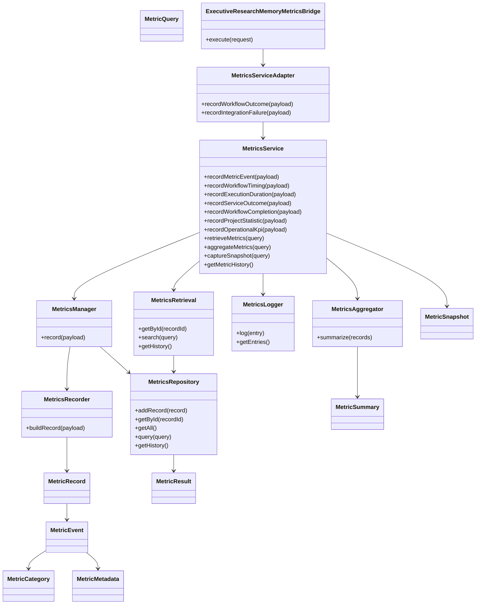

# Class Diagram - Metrics Service v1.0

```mermaid
classDiagram
  class MetricsService {
    +recordMetricEvent(payload)
    +recordWorkflowTiming(payload)
    +recordExecutionDuration(payload)
    +recordServiceOutcome(payload)
    +recordWorkflowCompletion(payload)
    +recordProjectStatistic(payload)
    +recordOperationalKpi(payload)
    +retrieveMetrics(query)
    +aggregateMetrics(query)
    +captureSnapshot(query)
    +getMetricHistory()
  }

  class MetricsManager {
    +record(payload)
  }

  class MetricsRepository {
    +addRecord(record)
    +getById(recordId)
    +getAll()
    +query(query)
    +getHistory()
  }

  class MetricsRecorder {
    +buildRecord(payload)
  }

  class MetricsRetrieval {
    +getById(recordId)
    +search(query)
    +getHistory()
  }

  class MetricsLogger {
    +log(entry)
    +getEntries()
  }

  class MetricsAggregator {
    +summarize(records)
  }

  class MetricRecord
  class MetricEvent
  class MetricCategory
  class MetricMetadata
  class MetricSummary
  class MetricQuery
  class MetricResult
  class MetricSnapshot

  class ExecutiveResearchMemoryMetricsBridge {
    +execute(request)
  }

  class MetricsServiceAdapter {
    +recordWorkflowOutcome(payload)
    +recordIntegrationFailure(payload)
  }

  MetricsService --> MetricsManager
  MetricsService --> MetricsRetrieval
  MetricsService --> MetricsAggregator
  MetricsService --> MetricsLogger
  MetricsManager --> MetricsRecorder
  MetricsManager --> MetricsRepository
  MetricsRetrieval --> MetricsRepository
  MetricsRecorder --> MetricRecord
  MetricRecord --> MetricEvent
  MetricEvent --> MetricCategory
  MetricEvent --> MetricMetadata
  MetricsRepository --> MetricResult
  MetricsAggregator --> MetricSummary
  MetricsService --> MetricSnapshot
  ExecutiveResearchMemoryMetricsBridge --> MetricsServiceAdapter
  MetricsServiceAdapter --> MetricsService
```
