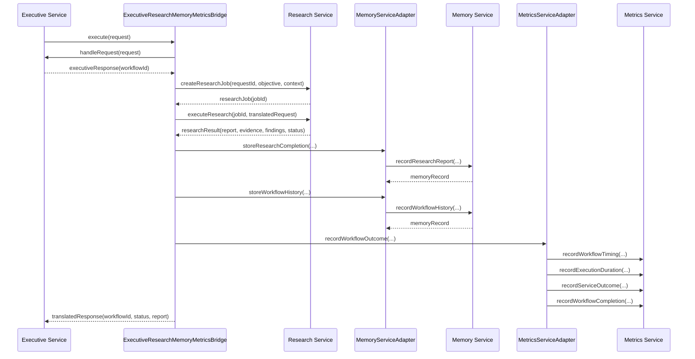

# Sequence Diagram - Executive -> Research -> Memory -> Metrics

```mermaid
sequenceDiagram
  participant Executive as Executive Service
  participant Bridge as ExecutiveResearchMemoryMetricsBridge
  participant Research as Research Service
  participant MemoryAdapter as MemoryServiceAdapter
  participant Memory as Memory Service
  participant MetricsAdapter as MetricsServiceAdapter
  participant Metrics as Metrics Service

  Executive->>Bridge: execute(request)
  Bridge->>Executive: handleRequest(request)
  Executive-->>Bridge: executiveResponse(workflowId)
  Bridge->>Research: createResearchJob(requestId, objective, context)
  Research-->>Bridge: researchJob(jobId)
  Bridge->>Research: executeResearch(jobId, translatedRequest)
  Research-->>Bridge: researchResult(report, evidence, findings, status)
  Bridge->>MemoryAdapter: storeResearchCompletion(...)
  MemoryAdapter->>Memory: recordResearchReport(...)
  Memory-->>MemoryAdapter: memoryRecord
  Bridge->>MemoryAdapter: storeWorkflowHistory(...)
  MemoryAdapter->>Memory: recordWorkflowHistory(...)
  Memory-->>MemoryAdapter: memoryRecord
  Bridge->>MetricsAdapter: recordWorkflowOutcome(...)
  MetricsAdapter->>Metrics: recordWorkflowTiming(...)
  MetricsAdapter->>Metrics: recordExecutionDuration(...)
  MetricsAdapter->>Metrics: recordServiceOutcome(...)
  MetricsAdapter->>Metrics: recordWorkflowCompletion(...)
  Bridge-->>Executive: translatedResponse(workflowId, status, report)
```
