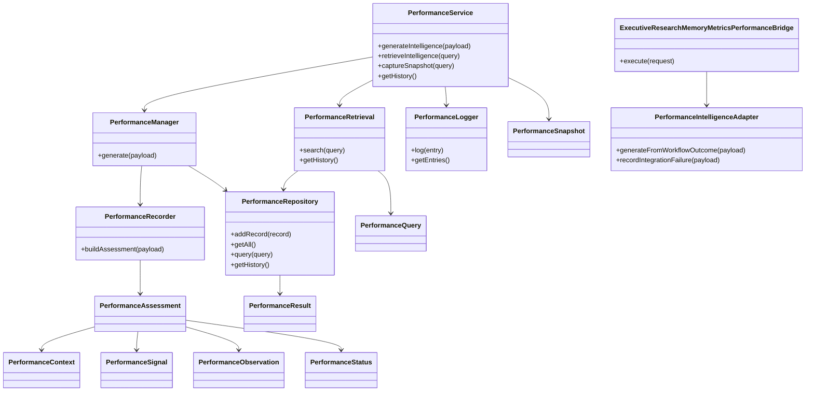

# Class Diagram - Performance Intelligence Service v1.0

```mermaid
classDiagram
  class PerformanceService {
    +generateIntelligence(payload)
    +retrieveIntelligence(query)
    +captureSnapshot(query)
    +getHistory()
  }

  class PerformanceManager {
    +generate(payload)
  }

  class PerformanceRecorder {
    +buildAssessment(payload)
  }

  class PerformanceRepository {
    +addRecord(record)
    +getAll()
    +query(query)
    +getHistory()
  }

  class PerformanceRetrieval {
    +search(query)
    +getHistory()
  }

  class PerformanceLogger {
    +log(entry)
    +getEntries()
  }

  class PerformanceAssessment
  class PerformanceContext
  class PerformanceSignal
  class PerformanceObservation
  class PerformanceStatus
  class PerformanceQuery
  class PerformanceResult
  class PerformanceSnapshot

  class PerformanceIntelligenceAdapter {
    +generateFromWorkflowOutcome(payload)
    +recordIntegrationFailure(payload)
  }

  class ExecutiveResearchMemoryMetricsPerformanceBridge {
    +execute(request)
  }

  PerformanceService --> PerformanceManager
  PerformanceService --> PerformanceRetrieval
  PerformanceService --> PerformanceLogger
  PerformanceManager --> PerformanceRecorder
  PerformanceManager --> PerformanceRepository
  PerformanceRetrieval --> PerformanceRepository
  PerformanceRecorder --> PerformanceAssessment
  PerformanceAssessment --> PerformanceContext
  PerformanceAssessment --> PerformanceSignal
  PerformanceAssessment --> PerformanceObservation
  PerformanceAssessment --> PerformanceStatus
  PerformanceRetrieval --> PerformanceQuery
  PerformanceRepository --> PerformanceResult
  PerformanceService --> PerformanceSnapshot
  ExecutiveResearchMemoryMetricsPerformanceBridge --> PerformanceIntelligenceAdapter
```
