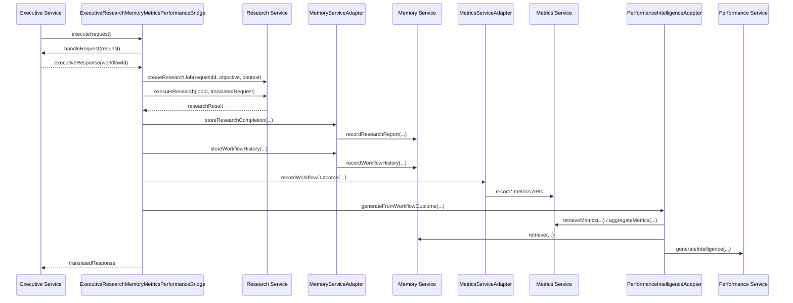

# Sequence Diagram - Executive -> Research -> Memory -> Metrics -> Performance Intelligence

```mermaid
sequenceDiagram
  participant Executive as Executive Service
  participant Bridge as ExecutiveResearchMemoryMetricsPerformanceBridge
  participant Research as Research Service
  participant MemoryAdapter as MemoryServiceAdapter
  participant Memory as Memory Service
  participant MetricsAdapter as MetricsServiceAdapter
  participant Metrics as Metrics Service
  participant PerfAdapter as PerformanceIntelligenceAdapter
  participant Perf as Performance Service

  Executive->>Bridge: execute(request)
  Bridge->>Executive: handleRequest(request)
  Executive-->>Bridge: executiveResponse(workflowId)
  Bridge->>Research: createResearchJob(requestId, objective, context)
  Bridge->>Research: executeResearch(jobId, translatedRequest)
  Research-->>Bridge: researchResult
  Bridge->>MemoryAdapter: storeResearchCompletion(...)
  MemoryAdapter->>Memory: recordResearchReport(...)
  Bridge->>MemoryAdapter: storeWorkflowHistory(...)
  MemoryAdapter->>Memory: recordWorkflowHistory(...)
  Bridge->>MetricsAdapter: recordWorkflowOutcome(...)
  MetricsAdapter->>Metrics: record* metrics APIs
  Bridge->>PerfAdapter: generateFromWorkflowOutcome(...)
  PerfAdapter->>Metrics: retrieveMetrics(...) / aggregateMetrics(...)
  PerfAdapter->>Memory: retrieve(...)
  PerfAdapter->>Perf: generateIntelligence(...)
  Bridge-->>Executive: translatedResponse
```
