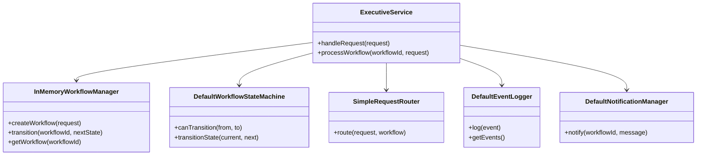
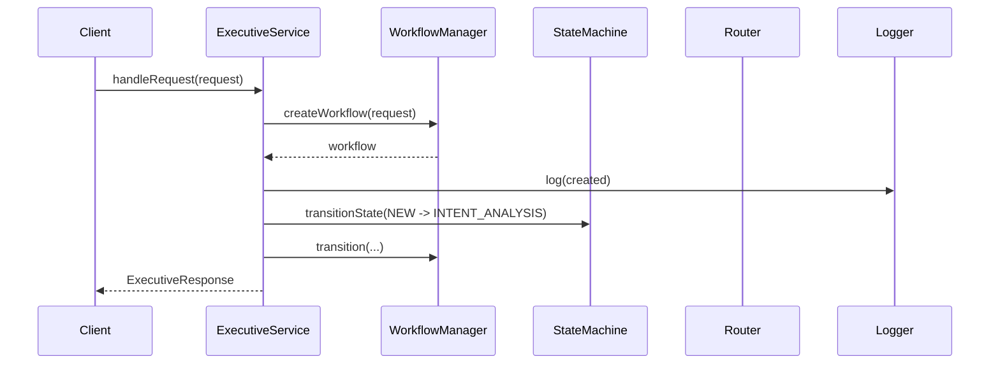

# Atlas Executive Service

## Directory structure

```text
executive/
  README.md
  package.json
  src/
    executive-service.js
    types.js
  test/
    executive-service.test.js
```

## Source files

- [src/executive-service.js](src/executive-service.js) — executive orchestration kernel with dependency-injected collaborators.
- [src/types.js](src/types.js) — workflow state definitions and service interface shapes.
- [test/executive-service.test.js](test/executive-service.test.js) — unit tests for workflow creation, transitions, routing, and logging.

## Class diagram



## Sequence diagram



## Unit test summary

Verified with Node test runner:

- workflow creation and workflow id assignment
- valid state transitions
- invalid state transitions
- routing to service hooks
- event logging

## Remaining TODO list

- Add richer transition coverage for the full state ladder.
- Introduce persistence for workflows beyond the in-memory manager.
- Wire the service interfaces to real Atlas services in a later work order.

## Engineering recommendations before Work Order #002

- Keep the executive service strictly orchestration-focused.
- Preserve the dependency-injected boundary between orchestration and future services.
- Add persistence and event-store support before introducing broader runtime integration.
