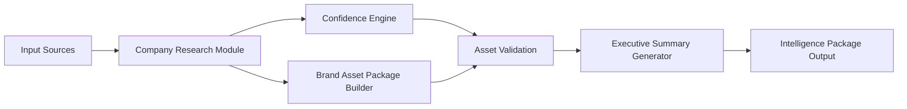

# Workflow

## Pipeline Steps
1. Ingest source data from website and public profile inputs.
2. Normalize fields into a canonical Company Research Module.
3. Score each field for extraction confidence.
4. Build a production-compatible Brand Asset Package.
5. Detect missing assets and uncertain values.
6. Produce Executive Summary for readiness decision.

## Exit Criteria
- Pipeline always emits structured output.
- Missing critical assets are surfaced as blocked findings.
- Low-confidence fields are explicitly flagged for human verification.
