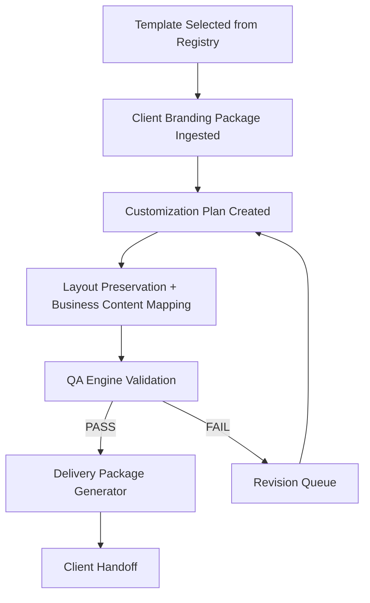

# Workflow

## End-to-End Production Workflow

## Stage Gates

### Gate 1: Template Approval Gate
- Template must be in `APPROVED` state.
- Active version must be defined.

### Gate 2: Branding Completeness Gate
- Required branding package fields must be present.
- Existing logo path must be present.

### Gate 3: Customization Safety Gate
- `preserveLayout` must remain `true`.
- Logo overwrite blocked unless explicit approval is true.

### Gate 4: QA Pass Gate
- All required QA checks must exist.
- Any check with `FAIL` blocks delivery.

### Gate 5: Delivery Readiness Gate
- Website package, QA report, launch checklist, and handoff summary must all exist.

## Operational Sequence
1. Registry service provides active approved template version.
2. Branding package service validates client content payload.
3. Customization service applies replacement map into template placeholders.
4. QA service validates consistency, quality, and completeness.
5. Delivery service emits final package and records traceability metadata.
