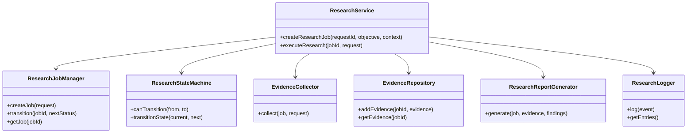
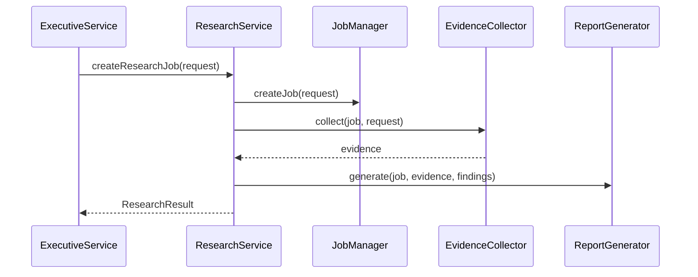

# Atlas Research Service

## Technical Design Review

### Proposed architecture
A small orchestration-first research service that accepts research requests from the Executive Service, creates research jobs, coordinates evidence collection, and produces structured research reports.

### Major modules
- ResearchService: orchestration façade for job creation and execution.
- ResearchJobManager: lifecycle and job state ownership.
- ResearchRequestManager: request normalization.
- ResearchCoordinator: orchestration seam for future async execution.
- EvidenceCollector: evidence acquisition boundary.
- EvidenceRepository: evidence storage seam.
- ResearchReportGenerator: report formatting.
- ResearchLogger: structured logging.

### Interfaces
- ExecutiveService interface for returning results.
- MemoryService interface for future persistence.
- PerformanceIntelligenceService interface for future analysis.
- MultiModelIntelligenceService interface for provider integration.
- AtlasInstituteService interface for future review.
- FutureResearchProviderInterface for provider plug-ins.

### Dependencies
- In-memory job store for v1.
- Provider-based evidence collection for future extension.
- Structured logging and report generation modules.

### Potential risks
- Future provider implementations need clear contracts.
- Asynchronous execution should be introduced carefully to preserve lifecycle clarity.
- Persistence and external provider integration are still deferred.

## Directory structure

```text
research/
  README.md
  package.json
  src/
    models.js
    interfaces.js
    research-service.js
    research-job-manager.js
    research-request-manager.js
    research-state-machine.js
    evidence-collector.js
    evidence-repository.js
    research-report-generator.js
    research-logger.js
  test/
    research-service.test.js
```

## Source files

- src/research-service.js — orchestration façade for research jobs and report generation.
- src/research-job-manager.js — job lifecycle and state management.
- src/research-state-machine.js — research job state transitions.
- src/evidence-collector.js — evidence collection boundary.
- src/evidence-repository.js — evidence storage seam.
- src/research-report-generator.js — report formatting.
- src/research-logger.js — structured logging.

## Class diagram



## Sequence diagram



## Unit test summary

- research request creation
- job lifecycle
- state transitions
- evidence collection orchestration
- report generation
- logging
- invalid state transitions

## Remaining TODO list

- Add persistence for research jobs and evidence.
- Introduce asynchronous execution and provider plug-in registration.
- Connect the service to real external providers in a later work order.

## Engineering recommendations

- Keep the research service strictly evidence-producing.
- Preserve the separation between orchestration and evidence acquisition.
- Add persistence before broadening to production workflows.
